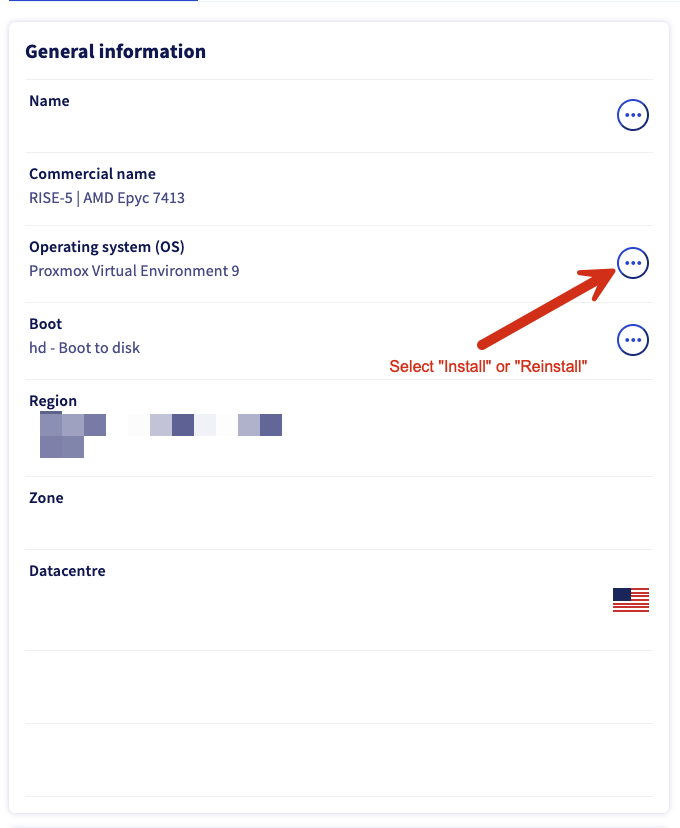
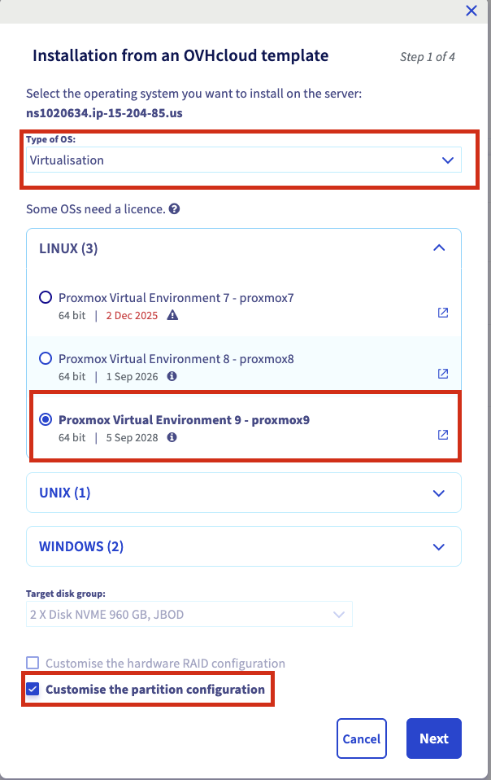
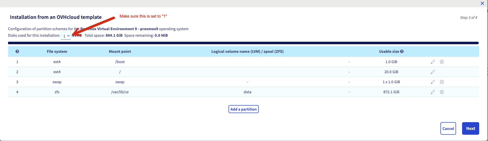
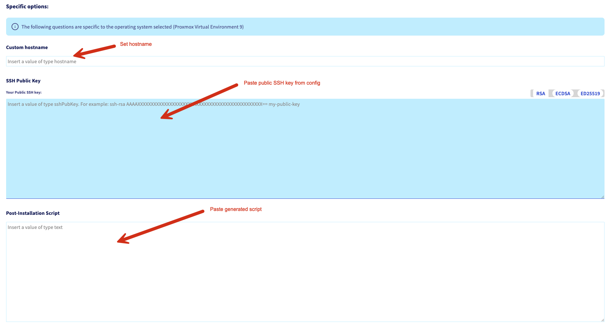

# Proxmox Installation Runbook

## Overview

This runbook walks through the process of installing Proxmox Virtual Environment on an OVH bare metal server using the OVH installation wizard. The installation process uses a custom post-installation script to configure SSH host keys, ensuring consistent server fingerprints and avoiding Trust On First Use (TOFU) security issues.

## Table of Contents

- [Overview](#overview)
- [Prerequisites](#prerequisites)
- [Step 1: Prepare Installation Values](#step-1-prepare-installation-values)
  - [1.1 Get the Hostname](#11-get-the-hostname)
  - [1.2 Extract SSH Public Key](#12-extract-ssh-public-key)
  - [1.3 Generate Post-Installation Script](#13-generate-post-installation-script)
- [Step 2: Access OVH Console](#step-2-access-ovh-console)
- [Step 3: Select Operating System](#step-3-select-operating-system)
- [Step 4: Configure Partition Scheme](#step-4-configure-partition-scheme)
- [Step 5: Configure Specific Options](#step-5-configure-specific-options)
  - [5.1 Set Custom Hostname](#51-set-custom-hostname)
  - [5.2 Add SSH Public Key](#52-add-ssh-public-key)
  - [5.3 Add Post-Installation Script](#53-add-post-installation-script)
  - [5.4 Start Installation](#54-start-installation)
- [Step 6: Wait for Installation](#step-6-wait-for-installation)
- [Step 7: Post-Installation Verification](#step-7-post-installation-verification)
  - [7.1 Verify SSH Host Key Fingerprints](#71-verify-ssh-host-key-fingerprints)
  - [7.2 Test SSH Connection](#72-test-ssh-connection)
  - [7.3 Verify Proxmox Version](#73-verify-proxmox-version)
  - [7.4 Verify Partition Layout](#74-verify-partition-layout)
  - [7.5 Access Web Interface](#75-access-web-interface)
- [Troubleshooting](#troubleshooting)
  - [Installation Fails at Post-Installation Script](#installation-fails-at-post-installation-script)
  - [SSH Host Keys Don't Match](#ssh-host-keys-dont-match)
  - [Wrong Number of Disks Used](#wrong-number-of-disks-used)
- [Next Steps](#next-steps)
- [References](#references)

## Prerequisites

Before starting the installation, you must have:

1. **Development environment configured**
   ```bash
   # Ensure you're in the repo root with devenv active
   cd /path/to/infra
   devenv shell
   ```

2. **SOPS encryption key available**
   ```bash
   # Run bootstrap script if you haven't already
   ./scripts/bootstrap-sops.sh
   ```

3. **Configuration values prepared**:
   - Node hostname from `config/proxmox/nodes.yaml`
   - SSH public key from `secrets/proxmox/ssh.enc.yaml`
   - Post-installation script generated

## Step 1: Prepare Installation Values

### 1.1 Get the Hostname

The hostname is defined in `config/proxmox/nodes.yaml`:

```bash
yq '.nodes[0].name' config/proxmox/nodes.yaml
```

For the first node (rk1), the hostname is: **rk1**

### 1.2 Extract SSH Public Key

Extract the admin SSH public key from the encrypted secrets:

```bash
sops -d secrets/proxmox/ssh.enc.yaml | yq -r '.ssh.admin.public_key'
```

Copy this key to your clipboard - you'll paste it into the OVH wizard.

### 1.3 Generate Post-Installation Script

Generate the installation script with embedded SSH host keys.

**Important**: The OVH web UI requires the post-installation script to be base64-encoded. Use the `--base64` flag:

```bash
./scripts/generate-proxmox-install-script.sh --base64
```

This will output the base64-encoded script to stdout. Copy the entire encoded string to your clipboard.

Alternatively, save to a file for easier copying:

```bash
./scripts/generate-proxmox-install-script.sh --base64 /tmp/proxmox-install-base64.txt
cat /tmp/proxmox-install-base64.txt
```

<details>
<summary>Viewing the plain script (for debugging)</summary>

If you want to see the actual bash script before encoding (useful for debugging):

```bash
# View plain script
./scripts/generate-proxmox-install-script.sh

# Or save plain version to file
./scripts/generate-proxmox-install-script.sh /tmp/proxmox-install.sh
cat /tmp/proxmox-install.sh
```

Note: The plain script is useful for debugging but cannot be used directly in the OVH web UI.

</details>

## Step 2: Access OVH Console

1. Log into the OVH control panel
2. Navigate to your dedicated server
3. Under the server's general information, locate the **Operating system (OS)** section
4. Click the **⋯** (three dots) menu button next to the OS field



5. Select **Install** or **Reinstall** from the dropdown menu

## Step 3: Select Operating System

The installation wizard will open. This is **Step 1 of 4**.



1. **Type of OS**: Select **Virtualisation** from the dropdown
2. **Operating System**:
   - Expand the **LINUX** section
   - Select **Proxmox Virtual Environment 9 - proxmox9** (64 bit)
3. **Target disk group**: Leave as default (2 X Disk NVME 960 GB, JBOD)
4. **Partition configuration**:
   - ☐ Leave "Customise the hardware RAID configuration" **unchecked**
   - ☑ **Check** "Customise the partition configuration"

Click **Next** to continue.

## Step 4: Configure Partition Scheme

You'll be taken to **Step 3 of 4** (Step 2 is skipped when not customizing RAID).



**IMPORTANT**: At the top of the screen, verify that "Disks used for this installation" shows **1** (not 2).

The default partition scheme should show:

| # | File system | Mount point | LVM/zpool name | Usable size |
|---|-------------|-------------|----------------|-------------|
| 1 | ext4        | /boot       | -              | 1.0 GiB     |
| 2 | ext4        | /           | -              | 20.0 GiB    |
| 3 | swap        | swap        | -              | 1 x 1.0 GiB |
| 4 | zfs         | /var/lib/vz | data           | ~872 GiB    |

This configuration:
- Uses only the first NVMe disk for Proxmox OS
- Creates a ZFS pool named "data" for VM storage
- Leaves the second NVMe disk available for additional storage configuration post-installation

Click **Next** to continue.

## Step 5: Configure Specific Options

You'll be taken to **Step 4 of 4**: Specific options.



### 5.1 Set Custom Hostname

In the **Custom hostname** field, enter the node name from `config/proxmox/nodes.yaml`:

```
rk1
```

### 5.2 Add SSH Public Key

In the **SSH Public Key** field:

1. Paste the admin SSH public key you extracted in Step 1.2
2. Ensure the key type is set to **ED25519** (should match your key format)

The key should look like:
```
ssh-ed25519 AAAAC3NzaC1lZDI1NTE5AAAA...
```

### 5.3 Add Post-Installation Script

In the **Post-Installation Script** text area:

1. Paste the entire **base64-encoded** script from Step 1.3
2. The pasted content should be a single block of base64 text starting with:
   ```
   IyEvYmluL2Jhc2gKIyBQcm94bW94IFBvc3QtSW5zdGFsbGF0aW9u...
   ```
3. The content should end with:
   ```
   c3VjY2Vzc2Z1bGx5IgoK
   ```

**Important**: Make sure you're pasting the **base64-encoded** version generated with the `--base64` flag, not the plain bash script. The OVH web UI requires base64 encoding.

### 5.4 Start Installation

Click **Next** to review your configuration, then confirm to start the installation.

## Step 6: Wait for Installation

The installation process will:

1. Wipe the selected disk
2. Install Proxmox Virtual Environment 9
3. Apply the partition scheme
4. Configure the hostname
5. Add your SSH public key to the root user's authorized_keys
6. Execute the post-installation script to set SSH host keys
7. Reboot the server

Installation typically takes 10-15 minutes.

## Step 7: Post-Installation Verification

### 7.1 Verify SSH Host Key Fingerprints

Once the server is online, verify the SSH host keys match the expected fingerprints.

The expected fingerprints are stored in `secrets/proxmox/ssh.enc.yaml`:

```bash
# Extract expected fingerprints
SOPS_AGE_KEY_FILE=secrets/.age-key.txt sops -d secrets/proxmox/ssh.enc.yaml | yq -r '.ssh.host_keys.ed25519.fingerprint_sha256'
SOPS_AGE_KEY_FILE=secrets/.age-key.txt sops -d secrets/proxmox/ssh.enc.yaml | yq -r '.ssh.host_keys.rsa.fingerprint_sha256'
```

When you first connect via SSH, verify the fingerprints match:

```bash
ssh root@<server-ip>
```

The SSH client will show the server's fingerprint. Verify it matches one of the expected values above.

### 7.2 Test SSH Connection

Load the admin SSH key into your SSH agent for easy access:

```bash
# Load the key into SSH agent (recommended)
./scripts/load-ssh-key.sh
```

This will extract the admin private key from secrets and add it to your SSH agent. You can now connect directly:

```bash
ssh root@<server-ip>
```

<details>
<summary>Alternative: Manual key extraction</summary>

If you prefer not to use the SSH agent, you can manually extract and use the key:

```bash
# Using the private key from secrets
sops -d secrets/proxmox/ssh.enc.yaml | \
  yq -r '.ssh.admin.private_key' > /tmp/proxmox-admin-key
chmod 600 /tmp/proxmox-admin-key

ssh -i /tmp/proxmox-admin-key root@<server-ip>

# Clean up temporary key
rm /tmp/proxmox-admin-key
```

</details>

### 7.3 Verify Proxmox Version

Once connected, verify Proxmox is installed correctly:

```bash
pveversion --verbose
```

Expected output should show Proxmox VE 9.x.

### 7.4 Verify Partition Layout

Check that the partition scheme was applied correctly:

```bash
# View disk layout
lsblk

# Verify ZFS pool
zpool status

# Check mount points
df -h
```

### 7.5 Access Web Interface

The Proxmox web interface should be accessible at:

```
https://<server-ip>:8006
```

**Note**: You'll need to access this through Tailscale or after configuring firewall rules, as the web interface is not publicly accessible by default.

## Troubleshooting

### Error Creating Installation Task

If you see an error like "An error has occurred while creating installation task on server":

**Cause**: The OVH web UI requires the post-installation script to be base64-encoded.

**Solution**:
1. Ensure you used the `--base64` flag when generating the script:
   ```bash
   ./scripts/generate-proxmox-install-script.sh --base64
   ```
2. Verify you're pasting the base64-encoded text (looks like `IyEvYmluL2Jhc2g...`), not the plain bash script
3. Try the installation again with the properly encoded script

### Installation Fails at Post-Installation Script

If the installation fails during the post-installation script phase:

1. Check the installation logs in the OVH console
2. Verify the generated script has no syntax errors:
   ```bash
   # Decode and check syntax
   ./scripts/generate-proxmox-install-script.sh /tmp/proxmox-install.sh
   bash -n /tmp/proxmox-install.sh
   ```
3. Re-generate the script and try again

### SSH Host Keys Don't Match

If the SSH fingerprints don't match the expected values:

1. The post-installation script may have failed
2. Manually verify the keys on the server:
   ```bash
   ssh-keygen -lf /etc/ssh/ssh_host_ed25519_key.pub -E sha256
   ssh-keygen -lf /etc/ssh/ssh_host_rsa_key.pub -E sha256
   ```
3. If needed, manually run the generated script on the server

### Wrong Number of Disks Used

If the installer used both disks instead of just one:

1. Reinstall the OS
2. In Step 4, ensure "Disks used for this installation" shows **1**
3. You may need to manually adjust the partition configuration to use only the first disk

## References

- Proxmox VE Documentation: https://pve.proxmox.com/pve-docs/
- OVH Dedicated Servers: https://help.ovhcloud.com/csm/en-dedicated-servers-getting-started
- Project configuration: `config/proxmox/`
- Secrets management: `secrets/proxmox/`
